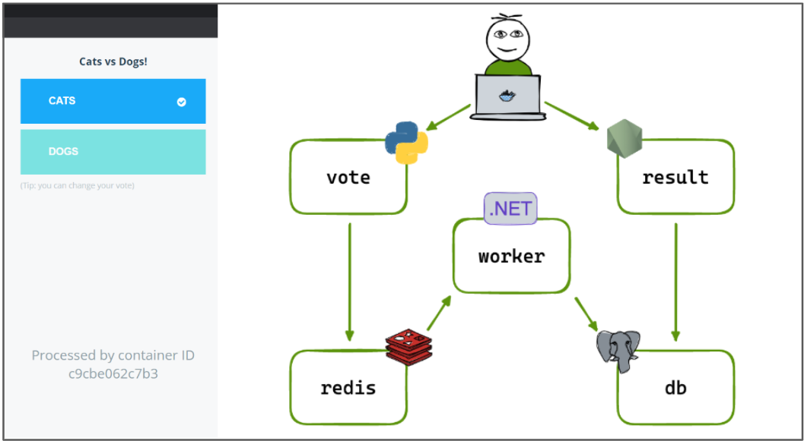

# Build a Multi-Container Voting App 
## Project Description:
This project creates a simple Voting App built on top of top of multiple Docker containers running on an AWS EC2 Instance. This project is built alongside a tutorial created by Mohammed Oghli in a [LinkedIn Article](https://www.linkedin.com/pulse/deploying-multi-container-docker-compose-application-aws-oghli/)

The original repository for this project belongs to a collection of sample docker projects, and is available [here](https://github.com/dockersamples/example-voting-app)

## Architecture and Application:

   
## Components Description:
| Component                | Functionality                                                                                                                                                                                                                                                                                                                                     |
| ------------------------ | ------------------------------------------------------------------------------------------------------------------------------------------------------------------------------------------------------------------------------------------------------------------------------------------------------------------------------------------------- |
| Python Web App           | A frontend web app which allows you to vote between two options (this is the first part of the UI. The second part is the results Web app built with Node.js. See below)                                                                                                                                                                          |
| Redis In-Memory Database | Collects new votes. Redis (Remote Dictionary Server) is an open-source, in-memory data structure store that can be used as a database, cache, and message broker. In this Use Case it is most likely used as a lightweight message broker to near-instanstly deliver notificaion/messages to the database (containing information about the vote) |
| .NET Worker              | A .NET worker which consumes votes and stores them in the Postgres database                                                                                                                                                                                                                                                                       |
| Postgres Database        | A Postgres database which collects and stores results from the .NET worker, and is backed by a Docker volume                                                                                                                                                                                                                                      |
| Node.js Web App          | A Web app which shows the results of the voting in real time                                                                                                                                                                                                                                                                                      |
| Amazon EC2               | An Ubuntu Server 22.04 LTS Server provisioned on an EC2 Instance to host the docker images                                                                                                                                                                                                                                                        |
## Helpful Tips:
- In Mohammed's Tutorial, he connects to the EC2 Instance by SSHing into it from his local machine. For this he first sets up the necessary credentials (creating a key pair and downloading the .pem file, etc). To save time and effort, you can skip this step and instead use the "EC2 Instance Connect" option of AWS which allows you to access the instance directly from the browser through your management console.
- When running the final docker-compose-ps command, you might receive some sort of "Health Check Failing with Persmission Denied" error message for Redis and Postgres container. If this happens you need to grant the permission manually by using the chmod command. You can read more about that [here](https://github.com/meeb/tubesync/issues/41)
## Learning Outcomes:
This is a great introductory project to expose you to containers and running containerized applications. It allows you to build a simple web application as a combination of Docker containers rather than a monolithic application. Doing so has several benefits, many of which can be applied to larger-scale, production grade applications. Some benefits include: 
- Improved Scalability
- Fault Isolation and Tolerance
- Technology Diversity 
- Efficient Resource Utilization
- Portability
- Security 
- ...And much more!